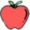
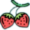

# Giới thiệu game

Xin chào mọi người, mình là Trường Giang. Project game này là một bài tập lớn trong môn học lập trình nâng cao tại Trường đại học Công nghệ sử dụng ngôn ngữ lập trình C++ kết hợp với thư viện SDL. Trò chơi của mình có tên gọi là Fruit-Catching Frog.
Đây là 1 game về hai chú ếch Pansy và Fluffy. Mục tiêu của 2 cậu là di chuyển khôn khéo để thu thập trái cây và né tránh bom, thuốc độc để đạt điểm cao nhất.

Link video demo: https://youtu.be/rpZYZXRb4rc

- [1. Cách tải game](#0-cách-tải-game)
    * [a. Cách 1: Không bao gồm code.](#a-cách-1-không-bao-gồm-code)
    * [b. Cách 2: Bao gồm code và có thể biên dịch.](#b-cách-2-bao-gồm-code-và-có-thể-biên-dịch)
- [2. Menu game](#2menu-gane)
- [3. Các nhân vật, enemy và items của game.](#3Các-nhân-vật,-enemy-và-items-của-game.)
- [4. Hướng dẫn chơi game](#4-hướng-dẫn-chơi-game)
- [5. Source code](#5-source-code)
- [6. Nguồn tham khảo và tài liệu](#6-nguồn-tham-khảo-và-tài-liệu)
- [7. Lời kết](#7-lời-kết)

# 1. Cách tải game

## a. Cách 1: Không bao gồm code.

Tải game (được nén thành .zip) tại [link sau](https://github.com/Giangdurian/Fruit-catching-frog).

Khi tải xong giải nén vào 1 folder và click vào file Fruit-Catching Frog.exe để bắt đầu game.

## b. Cách 2: Bao gồm code và có thể biên dịch.

**Bước 1:** Cài Visual Studio. Bạn có thể cài đặt các phiên bản của Visual Studio tại trang sau: https://visualstudio.microsoft.com/. 

Lưu ý: Mình recommend tải phiên bản Community 2022.

**Bước 2:** Clone repo này về bằng lệnh "git clone + link.git của repo này" trên terminal máy bạn hoặc Chọn Code -> Download Zip. Giải nén code ra 1 Folder và mở File Fruit-Catching Frog.sln

**Bước 3:** Cài đặt các thư viện SDL và môi trường: Vì mình đã tạo thư mục SDL_Lib_VS chứa các thư viện cần thiết cho việc chạy game nên bạn không cần phải mất công tải lại các thư viện này nữa. Bạn chỉ cần làm theo các hướng dẫn trên [lazyfoo](https://lazyfoo.net/tutorials/SDL/01_hello_SDL/windows/msvc2019/index.php) (bắt đầu từ bước 4) là đã có thể chạy được game rồi. 

**Bước 4:** Run code bằng cách click vào Local Window Debugger.

# 2. Menu game
Menu gồm có 4 chức năng chính, bao gồm 4 nút:

- PLAY: Khi người chơi click vào nút PLAY, sẽ có hai chế độ:

    - Chế độ single: Một người chơi.
    - Chế độ 2 players: Hai người chơi.
    
    Sau khi chọn 1 trong hai chế độ, trò chơi bắt đầu.
    

    
    
    

    
- TUTORIAL: Nút TUTORIAL sẽ hiện ra màn hình giới thiệu về game và hướng dẫn người dùng cách chơi game

- DIFFICULTY: Nút DIFFICULTY dùng để chọn mức độ khó của game. Có 2 mức độ là Medium và Hard. Nếu chọn mức độ Hard, số lượng của các enemy sẽ nhiều hơn và vận tốc cũng sẽ nhanh hơn so với mức độ Medium.

- QUIT: Khi click vào nút này, game sẽ dừng và người chơi thoát khỏi chương trình.

- Lưu ý: Khi đã click 1 trong 3 nút đầu tiên, người chơi có thể chọn  nút mũi tên quay lại để trở về Menu ban đầu.

# 3. Các nhân vật, enemy và items của game.
- Nhân vật:

    -    Player1 (Pansy)  : là nhân vật chú ếch màu đỏ.
    
    
    -    Player2 (Fluffy)  : là nhân vật chú ếch màu xanh.

- Item:

    - Fruit: Là các trái cây được spawn ngẫu nhiên từ phía trên. Các loại quả bao gồm:

        - Dưa hấu (Melon)  
        - Nho (Grape)  
        - Cherry  
        - Chuối (Banana)  
        - Táo (Apple)  
        - Dâu tây (Stawberry)  

    - Item hỗ trợ:
    

        | Tên  | Hình ảnh  | Tính năng |
        | :------------ |:---------------:| :-----|
        | Tim(HP)       |  |Cộng thêm 1 mạng cho người chơi ăn được |
        | Khiên(Shield) |  | Bảo vệ người chơi khỏi ba enemy bất kì trong vòng 5 giây   |

- Enemy:

    | Tên  | Hình ảnh  | Tính năng |
    | :----- |:---------------------:| :-----|
    | Bombs (Bom)      |  |Là những trái bom với cách di chuyển va đập với các cạnh của màn hình và bật ra, vận tốc quả bom sẽ thay đổi mỗi lần va chạm vào màn hình nhưng không vượt quá vận tốc giới hạn. Khi dính 1 trái bom, nó sẽ biến mất nhưng nhân vật cũng sẽ mất một mạng.                  |
    | Posions (Thuốc độc)      |         |   Là những bình thuốc độc rơi xuống cùng với các item fruits từ phía trên. Cũng giống như bom, khi người chơi dính thuốc độc, người chơi sẽ mất 1 mạng. |

# 4. Hướng dẫn chơi game:

- Khi chọn và mục START, người chơi có thể chọn 1 trong 2 options là single hoặc 2 players như đã nói phía trên. 

    - Trong chế độ single player, người chơi (player 1) sẽ sử dụng các phím A, W, D để điều khiển nhân vật của mình. Sử dụng phím A để di chuyển sang trái, phím D để di chuyển sang phải, và phím W để nhảy lên. Nhiệm vụ của người chơi là điều khiển nhân vật di chuyển để ăn quả, các items và tránh né các kẻ thù để sống lâu nhất có thể. Trò chơi kết thúc khi player hết số mạng (HP1 = 0).
    - Trong chế độ 2 players, player 1 vẫn sử dụng các phím A, W, D như trong chế độ single, trong khi player 2 sẽ sử dụng các phím mũi tên (↑, ←, →) để điều khiển nhân vật của mình. Trò chơi kết thúc khi cả hai player đều hết số mạng.
    

- Pause game: Khi đang trong ván chơi, người chơi có thể tạm dừng trò chơi bằng cách nhấn phim Esc. Khi đó, sẽ hiện ra ba options:

    * Resume: Tiếp tục lần chơi hiện tại
    * Restart: Bắt đầu một ván chơi mới
    * Menu: Trở lại Menu chính của game

- Khi trò chơi kết thúc, điểm số của từng người chơi sẽ được hiển thị. Lưu ý: Trong chế độ chơi hai người, kết quả sẽ xác định người chiến thắng. Nếu hai người chơi có số điểm bằng nhau, kết quả sẽ là Draw (Hòa); nếu điểm số của hai player khác nhau, người có điểm số cao hơn sẽ chiến thắng (winner) và hình ảnh player đó sẽ được hiển thị trên màn hình.

# 5. Source code

- Folder SDL_Lib_VS: Là folder chứa tất cả các thử viện SDL cần thiết như SDL2_image, SDL2_mixer, SDL2,... để có thể hỗ trợ đầy đủ cho việc xây dựng và chạy game.
- Folder img_for_rm: Là folder chứa các hình ảnh để hiện thị lên github cho file readme.

- Folder Fruit-Catching Frog: Là folder chính chứa tất cả source code của game:
    * Folder img chưa các hình ảnh chính của game như: Background, Hình ảnh nhân vật, quả, items hỗ trợ, enemy,...
    * Folder img2: Chứa các hình ảnh để tạo hiệu ứng nổ (explosion) cho game.
    * Folder sound: Chứa tất cả các âm thanh của game.
    * GameObject(.h)(.cpp): Là các file xử lý và cập nhât các nhân vật, bao gồm các thuộc tính như vị trí, kích thước, vận tốc, lượng máu(HP), trạng thái (đã chết(isDead), đang nhảy(isJumping)),...
    * TextureManager(.h)(.cpp): Là các file đơn giản xử lý để tạo ra 1 texture mới từ 1 đường dẫn đầu vào, thường là 1 file ảnh.
    * Fruit: cung cấp các phương thức để cập nhật vị trí và copy các trái cây hay items hỗ trợ lên renderer, cũng như kiểm tra va chạm giữa các quả trái và người chơi.
    * Enemy(.h)(.cpp): Là các file cung cấp các phương thức để cập nhật vị trí, copy các trái bom hỗ trợ lên renderer, cũng như kiểm tra va chạm giữa các trái bom và người chơi.
    * Posion(.h)(.cpp): Có cấu trúc và phương thức cập nhật khả giống với Fruit, nhưng bản chất là 1 enemy.
    * Explosion(.h)(.cpp): Là các file xử lý và render hiệu ứng nổ.
    * Game(.h)(.cpp): Là file xử lý mạch chính của trò chơi có các chức năng chính:
        
        *  init(): Hàm này được sử dụng để khởi tạo cửa sổ game và các thành phần khác như renderer, font, âm thanh, và cài đặt các biến cho trò chơi.
        *  Bao gồm các hàm spawn để spawn ngẫu nhiêu fruits, items hay enemy và spawn lần đầu tiên ngay khi game vừa bắt đầu.
        *  Hàm HandleEvent() được sử dụng để xử lý sự kiện của SDL như click chuột, nhấn phím.
        *  Hàm update() được sử dụng để cập nhật trạng thái của trò chơi, bao gồm việc spawn các đối tượng, xử lý va chạm và cập nhật điểm số.
        *  Hàm endgame() được sử dụng để kết thúc trò chơi khi người chơi thua hoặc chọn chức năng restart, dọn dẹp tài nguyên và hiển thị kết quả cuối cùng.
        *  Hàm render để render được sử dụng để vẽ các đối tượng và giao diện người dùng lên màn hình.
        *  Hàm cleanup() và clean() có nhiệm vụ  giải phóng bộ nhớ và dọn dẹp tài nguyên và thoát khỏi SDL sau khi trò chơi kết thúc hoặc bị đóng.
    * main.cpp: file main chứa vòng lặp chính của trò chơi, trong mỗi vòng lặp:
        * Xử lý sự kiện: Hàm handleEvent() được gọi để xử lý sự kiện từ người chơi như chuột hoặc bàn phím.
        * Cập nhật trạng thái trò chơi: Nếu trò chơi đang ở trạng thái đang chơi (playing() trả về true), thì hàm update() được gọi để cập nhật trạng thái của trò chơi.
        * Vẽ trạng thái hiện tại của trò chơi lên màn hình: Hàm render()
        * Đảm bảo tần số khung hình (FPS): Đoạn code này đảm bảo rằng trò chơi chạy với tần số khung hình (FPS) nhất định bằng cách chờ một lượng thời gian sau mỗi khung hình.

# 6. Nguồn tham khảo và tài liệu

- Tham khảo: những phần căn bản về SDL cũng như cách xây dựng khung chương trình mình chủ yếu học từ Channel youtube [Let's Make Game](https://www.youtube.com/@CarlBirch). Bên cạnh đó, mình cũng tham khảo các nguồn tài liệu và tutorial trên [Lazyfoo](https://lazyfoo.net/tutorials/SDL/index.php) và nhiều repo github game khác.

- Về hình ảnh và âm thanh: 
    - Hình ảnh: Mình lấy hình ảnh chủ yếu từ source một tựa game khá nổi tiếng "Cut the rope" của nhà phát triển [zeptolab](https://www.zeptolab.com/) và một số hình ảnh mình tìm kiếm random trên google (thấy cái nào hợp thì pick).
    - Âm thanh: Hai âm thanh nền được lấy từ âm thanh của video [Cut the Rope OST | 2010 | PC - complete soundtrack in one video](https://www.youtube.com/watch?v=-FC__c7ymKY&list=LL&index=2). Các âm thanh khác như hiệu ứng khi ăn quả, items, khi bị bom nổ,... mình cũng lên google tìm đến khi thấy soundtrack phù hợp thì lấy.

# 7. Lời kết
Em xin gửi lời cảm ơn đến:
 
 - Thầy Lê Đức Trọng vì đã giúp em hình dung và xây dựng khung chương trình để phát triển một game hoàn chỉnh, cùng với việc hiểu quy trình và kỹ năng quản lý dự án.
 - Thầy Trần Trường Thủy vì đã hướng dẫn em các thao tác cơ bản và xây dựng hình ảnh đồ họa SDL cho game, giúp em áp dụng kiến thức vào project.

Qua project em đã học thêm được được:
 - cách xây dựng khung và phát triển 1 project hoàn chỉnh 
 - cách sử dụng thư viện đồ họa SDL
 - cách quản lý mã nguồn trên github
 - hiểu sâu hơn về kiểu dữ liệu hướng đối tượng(OOP)

